layout: true

```{r setup, include=FALSE}
options(htmltools.dir.version = FALSE)

knitr::opts_chunk$set(
	echo = FALSE,
	fig.align = "center",
	message = FALSE,
	warning = FALSE,
	cache = FALSE
)
```

```{r eval=FALSE, include=FALSE}
library(knitr)
library(tidyverse)
library(widgetframe)
```
---
class: middle, center  

# Leonardo F. Nascimento

```{r out.width="25%"}

```

## 15% Programador, 20% Químico, 25% Psicólogo, 40% Cientista Social
<br>

### [Email: **leofn3@gmail.com**](mailto:leofn3@gmail.com) 

### [Twitter:**@leofn3**](http://www.twitter.com/leofn3) 

### [website: **www.leofn.com**](http://www.leofn.com)

---
class: middle, center  

```{r, out.width="50%"}
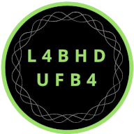
```

## Laboratório de Humanidades Digitais da UFBA

**Twitter**: [@labhdufba](https://twitter.com/labhdufba) 
<br>
**Instagram**: [@labhdufba](http://instagram.com/labhdufba)
<br>
**Github**: [https://github.com/LABHDUFBA](https://github.com/LABHDUFBA)
<br>
**Youtube**: [https://www.youtube.com/c/LABHDUFBA](https://www.youtube.com/c/LABHDUFBA)


---
class: inverse, center, middle

# Aspectos gerais das sociedades digitais contemporâneas...

---
class: middle, center

## "Digitalização do eu na vida cotidiana" 

```{r, out.width="80%"}
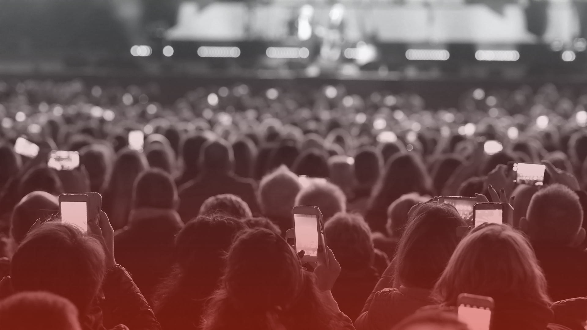
```
---
class: middle, center

## Algoritmização de processos sociais

```{r, out.width="60%"}
knitr::include_graphics("img/matrix-digital-self.png")
```

---
class: middle, center

## Traços digitais (digital data trace)

```{r, out.width="75%"}

```

---
class: middle, center

## Dataficação

```{r, out.width="75%"}
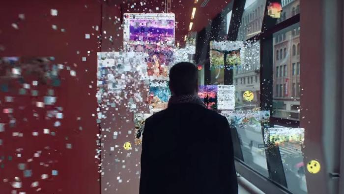
```

---
class: middle, center

## Cultura de vigilância


```{r, out.width="65%"}
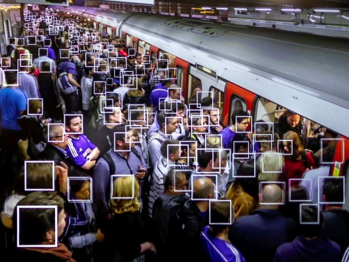
```

---
class: inverse, center, middle

# Qual o papel da sociologia nesse mundo digital de dados continuamente produzidos?

```{r, out.width="100%"}
knitr::include_graphics("https://media.giphy.com/media/pOEbLRT4SwD35IELiQ/giphy.gif?cid=ecf05e475vot0dyqf7ocbyf43eh75omn2pjcymz4m65rzbf4&rid=giphy.gif&ct=g")
```
---
class: inverse, center, middle

# Nós precisamos de uma **sociologia digital**?

---
class: middle, center

.pull-left[

# 2000

```{r, out.width="110%"}
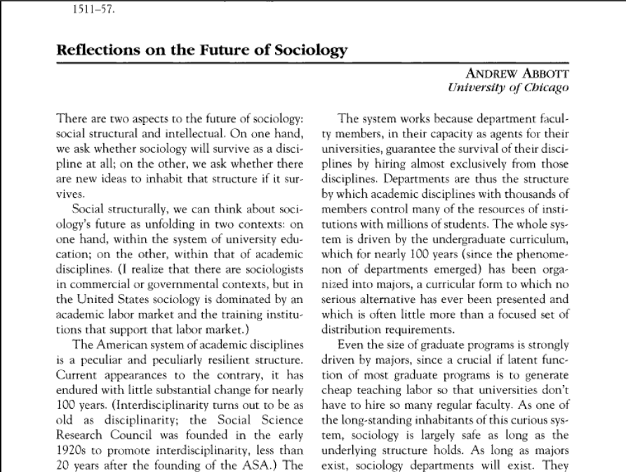
```
[Clique para acessar](https://doi.org/10.2307/2654383)
]
.pull-right[
# 2007

```{r, out.width="110%"}
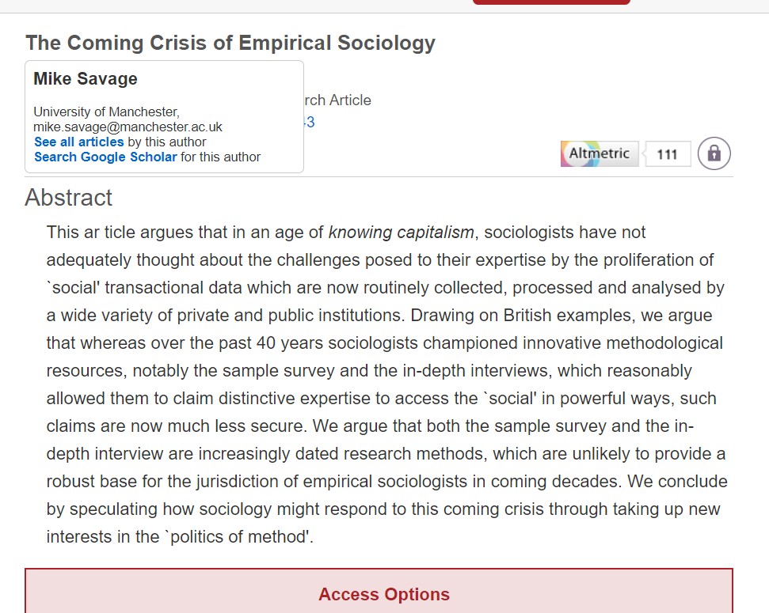
```
[Clique para acessar](https://journals.sagepub.com/doi/10.1177/0038038507080443)

]

---
class: middle, center

.pull-left[
#2009

```{r, out.width="100%"}
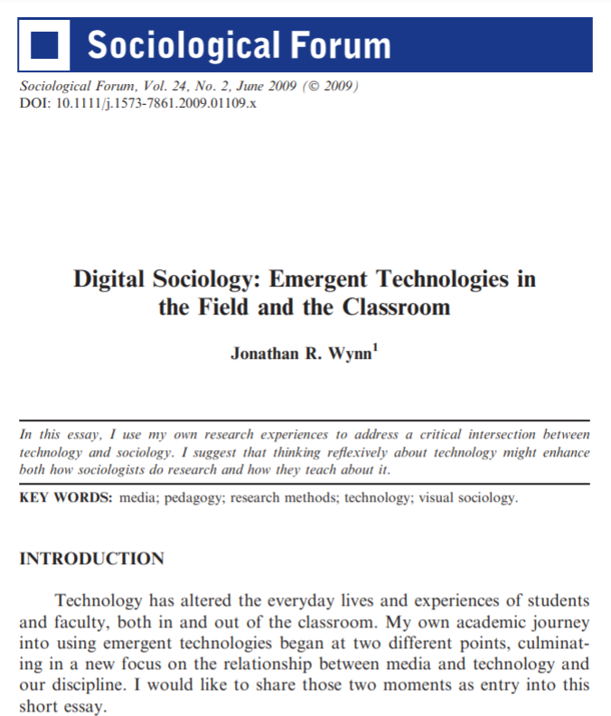
```
[Clique para acessar](https://doi.org/10.1111/j.1573-7861.2009.01109.x)

]
.pull-right[

#2013

```{r, out.width="80%"}
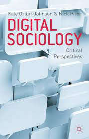
```
[Clique para acessar](https://www.amazon.com.br/Digital-Sociology-Perspectives-Kate-Orton-Johnson/dp/0230222838)
]

---
class: middle, center

.pull-left[

#2015

```{r, out.width="100%"}
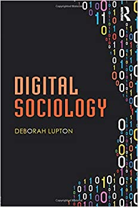
```
[Clique para acessar](https://www.amazon.com.br/Digital-Sociology-Deborah-Lupton/dp/1138022772/ref=sr_1_1)

]
.pull-right[

#2017

```{r, out.width="100%"}
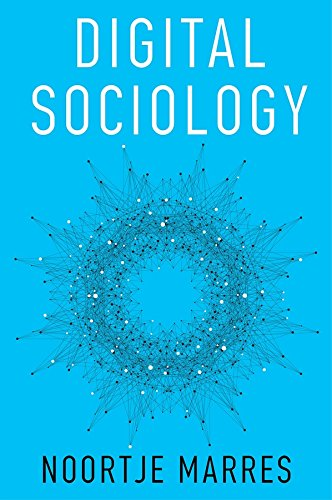
```
[Clique para acessar](https://www.amazon.com.br/Digital-Sociology-Reinvention-Research-English-ebook/dp/B071HRPK4B/ref=sr_1_2)
]


---
class: middle, center

.pull-left[

#2016

```{r, out.width="100%"}
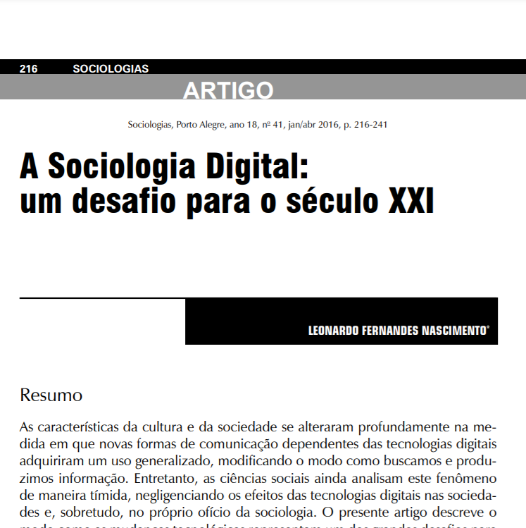
```
[Clique para baixar](https://www.scielo.br/j/soc/a/y9gtcQSrjjXVyRfryrKpXBk/?format=pdf&lang=pt
)
]

.pull-right[

#2021

```{r, out.width="80%"}
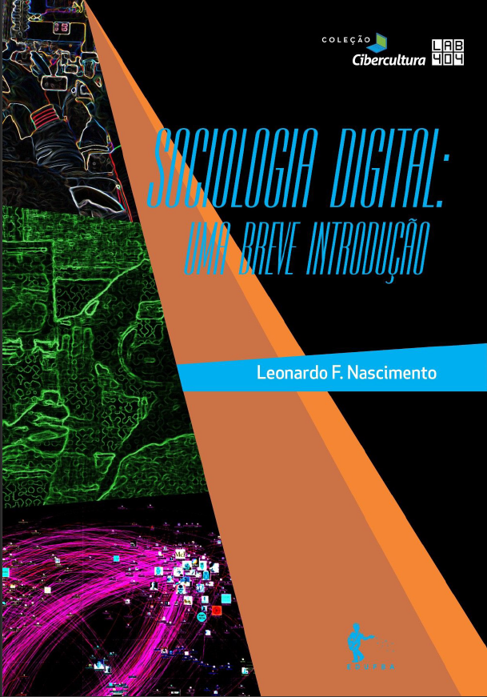
```
[Clique para baixar](https://repositorio.ufba.br/ri/handle/ri/32746/statistics)]

---

class: inverse, center, middle

# Como eu cheguei na **sociologia digital**? (ou era uma vez um **N00b**...)

```{r, out.width="60%"}
knitr::include_graphics("https://media.giphy.com/media/9rtpurjbqiqZXbBBet/giphy.gif")
```

---
class: middle, center

## 2009: ATLAS.ti e Sphinx 
<br>
--

## 2010: Endnote e Zotero
<br>
--

## 2014 e 2015: R/Rstudio (MQ/UFMG)
<br>
--

## 2016: Webscraping em Python
<br>
--

## de 2017 até hoje: Github, (+)R, (+)Python  
<br>

---
class: inverse, center, middle

# O que significa o **digital** na **sociologia digital**?

---
class: middle, center

--
## 1. Digital como **objeto de pesquisa**;
<br>

--
## 2. Digital como **instrumentos e métodos de pesquisa**;
<br>

--
## 3. Digital como **plataforma** para nos engajarmos com audiências e públicos mais amplos.

---
class: inverse, center, middle

# Três conjuntos de **desafios**?

---
class: middle, center

# **Dados digitais**
<br>

--
## Publicidade e acessibilidade
<br>

--
## Terceirização da etapa de coleta de dados
<br>

--
## Evoca versus coleta (*repurpose* - Salganik, 2020)
<br>

--
## Representatividade dos dados
<br>

--
## big data (Cf. Salganik, 2020)
<br>

---
class: middle, center

# **Métodos digitais**
<br>

--
## Letramento digital
<br>

--
## Articulação analógico e digital
<br>

--
## Superação da suposta oposição Quali-quanti
<br>

--
## Crítica e epistemológica às ferramentas digitais
<br>

---
class: middle, center

# **Plataformas**
<br>

--
## Presença digital: visibilidade e engajamento
<br>

--
## Tentação ao profetismo
<br>

--
## Sedução das lógicas de metrificação das plataformas
<br>

---
class: inverse, center, middle

# Para finalizar: como eu aprendo a fazer **sociologia digital**?

---
class: middle, center

## Obrigado gente!

.pull-left[
```{r, out.width="70%"}
knitr::include_graphics("https://media.giphy.com/media/JQRVMKkWAQbdiXFBkg/giphy.gif")
```
]
.pull-right[
##**Agradecimentos especiais**:
<br>

### Prof. Jimmy Medeiros e ao Laboratório de Humanidades Digitais do CPDOC- Pelo convite!
<br>

### Ao público pela paciência!
]

